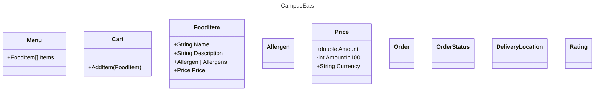
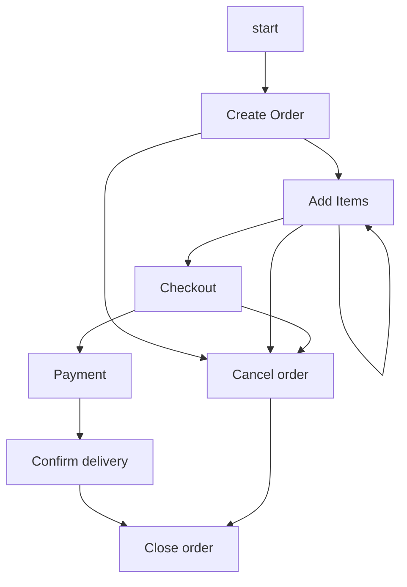

# CampusEats

Food ordering service for students on campus.

## Things you should be able to do

* Order food from the comfort of your room.
* Make money by delivering food to other students.

### Administration

* Keep track of orders.
* Keep track of delivery people.
* Keep track of the health of the system.
* Maintain the menu.
* Maintain prices

## Use Cases / User Stories

**User story form:**  
As a [role]  
I want to [goal]  
So that [reason]  

**Requirements form:**  
Given [context]  
When [event]  
Then [outcome]

### Order food from the comfort of your room

* As a student, I want to be able to order food from my room,
  so that I don't have to stop what I'm doing

* As a student, I want to be able to see the menu, so that I can
  decide what I want to eat.

* As a student, I want to be able to see the price of each item,
  so that I know what I can afford.

* As a student, I want to be able to see the total price of my order, so that I know how much I will be charged.

* As a student, I want to be able to see the estimated time of delivery, so that I know when to expect my food.

* As a student, I want to be able to see the status of my order,
  so that I know when to expect my food, and whether it has been picked up.

* As a student, I want to be able to cancel my order, so that I won't be charged for a mistaken order.

#### Requirements:

**As a student, I want to be able to cancel my order, so that I won't be charged for a mistaken order.**

Given I have placed an order  
When I cancel the order  
Then I will not be charged for the order

Given I have placed an order,
    and the order has been picked up  
When I cancel the order  
Then I will be told that I cannot cancel the order.

Given I have placed an order,
    and the order has been delivered  
When I cancel the order  
Then I will be told that I cannot cancel the order.

Given I have placed an order,
    and the order has been delivered  
When I view the order status page
Then the cancel button will not be shown.

## Entities

Menu
Cart
FoodItem
Allergen
Price
Order
OrderStatus
DeliveryLocation
Rating

## Order

## Kommandoer for å starte ny .sln

Gå til mappen man ønsker å starte ny solution i

dotnet new sln -n CampusEats
dotnet new classlib -n CampusEats.Core
dotnet new xunit -n CampusEats.Tests
dotnet sln add ./CampusEats.Core/
dotnet sln add ./CampusEats.Core/CampusEats.Core.csproj
dotnet sln add ./CampusEats.Tests/CampusEats.Tests.csproj
cd ./CampusEats.Tests/
dotnet add reference ../CampusEats.Core/CampusEats.Core.csproj
cd ..
code .

## Markdown preview 
shift + cmd + v